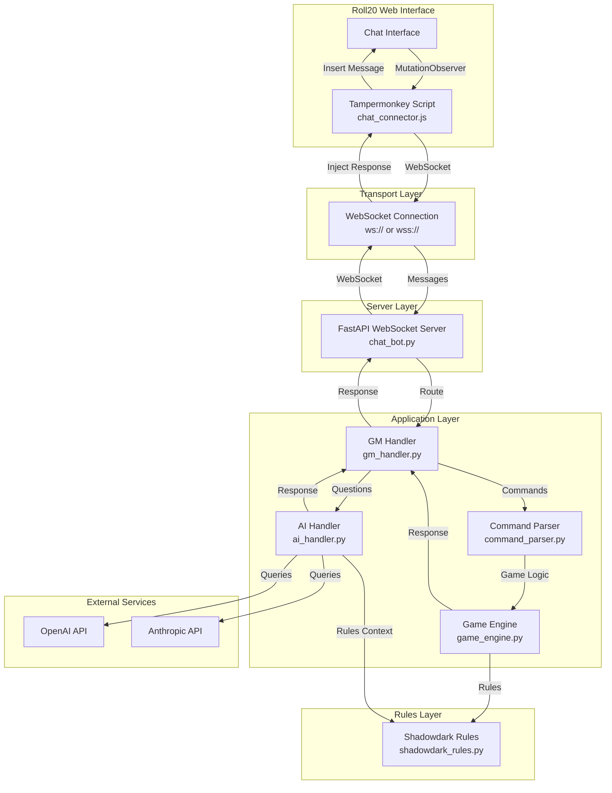
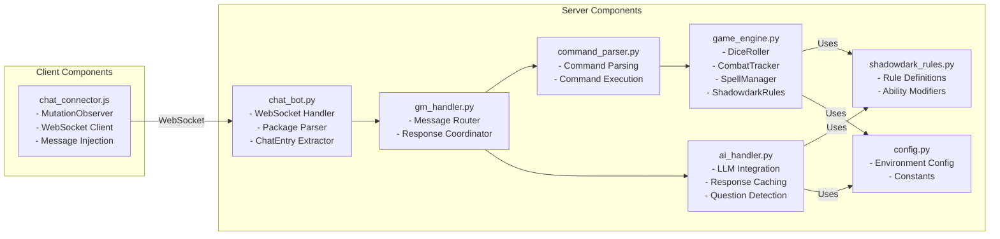
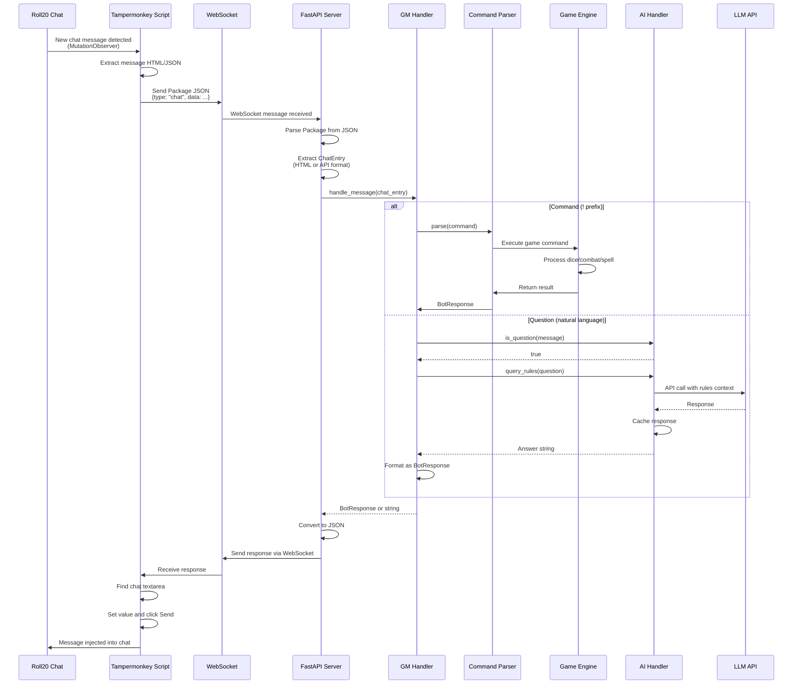
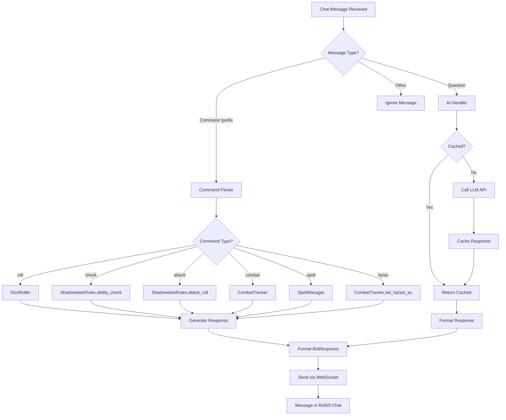
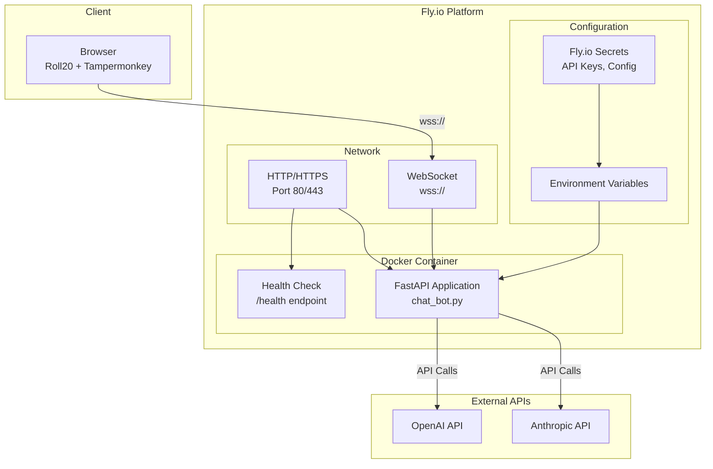

# ADR 0001: Architecture Overview

## Status

Accepted

## Context

The Roll20 GM Chatbot is a Game Master assistant for Shadowdark RPG that integrates with Roll20's web-based virtual tabletop. The system provides:

- **Dice Rolling**: Parse and execute dice expressions (e.g., `2d6+3`, `1d20`)
- **Ability Checks**: Perform ability checks with DC calculations
- **Combat Tracking**: Manage initiative, turn order, HP, AC, and status effects
- **Spell Management**: Track spell slots and handle spell casting
- **AI-Powered Rules**: Answer natural language questions about Shadowdark RPG rules using LLMs
- **Command-Based Actions**: Quick commands for common game actions

The system operates as a bridge between Roll20's web interface (which doesn't provide a direct API) and a Python backend that processes game commands and provides AI-powered rule clarifications.

## Decision

We have implemented a **WebSocket Bridge Architecture** that connects Roll20's chat interface to a Python backend service. The architecture consists of:

1. **Client Layer**: A Tampermonkey userscript that monitors Roll20 chat and communicates via WebSocket
2. **Transport Layer**: WebSocket connection (ws:// for local development, wss:// for production)
3. **Server Layer**: FastAPI WebSocket server that handles connections and message routing
4. **Application Layer**: Modular components for command parsing, game mechanics, and AI integration
5. **Rules Layer**: Shadowdark RPG rule definitions and constants

## System Architecture

### High-Level Architecture

### Component Architecture

## Data Flow

### Message Flow Sequence

### Component Interactions

## Key Architectural Decisions

### 1. WebSocket Bridge Pattern

**Decision**: Use WebSocket to bridge Roll20's web interface with Python backend.

**Rationale**: 
- Roll20 doesn't provide a direct API for chat integration
- Browser extension (Tampermonkey) can monitor DOM changes
- WebSocket provides real-time bidirectional communication
- Enables seamless integration without modifying Roll20's codebase

**Consequences**:
- Real-time message processing
- Low latency communication
- Requires WebSocket support (wss:// for HTTPS pages)
- Connection management needed (reconnection logic)

### 2. Command-Based Interface

**Decision**: Use `!` prefix for structured commands, natural language for AI queries.

**Rationale**:
- Clear distinction between structured commands and free-form questions
- Easy to parse and route to appropriate handlers
- Familiar pattern for many chat bots
- Allows precise game mechanics execution

**Consequences**:
- Predictable command execution
- Easy to extend with new commands
- Users must learn command syntax
- Natural language for rule queries is more intuitive

### 3. Stateless Game State

**Decision**: Combat tracker and spell manager are in-memory (per-instance), not persisted.

**Rationale**:
- Simplicity: no database required
- Fast access: in-memory operations
- Sufficient for single game session per instance
- Reduces infrastructure complexity

**Consequences**:
- Simple deployment (no database)
- Fast in-memory operations
- State lost on server restart
- One game session per instance
- No state sharing across instances

### 4. Dual AI Provider Support

**Decision**: Support both OpenAI and Anthropic with provider abstraction.

**Rationale**:
- Flexibility: users can choose preferred provider
- Redundancy: fallback if one provider has issues
- Cost optimization: use different models for different needs
- Future-proof: easy to add more providers

**Consequences**:
- Provider flexibility
- Better error handling (provider-specific messages)
- More complex configuration
- Caching works across providers

### 5. Backward Compatibility

**Decision**: Support both old HTML format and new Roll20 API format for messages.

**Rationale**:
- Roll20 API format provides structured data (messageId, characterId, rollData)
- Old HTML format still used in some contexts
- Gradual migration path
- Maintains compatibility during transition

**Consequences**:
- Works with both message formats
- More complex parsing logic
- Smooth transition path

### 6. Monolithic Deployment

**Decision**: Single FastAPI application deployed to Fly.io.

**Rationale**:
- Simplicity: single service to deploy and manage
- Sufficient for current scale
- FastAPI handles both HTTP and WebSocket
- Easy to scale horizontally if needed

**Consequences**:
- Simple deployment
- Single codebase
- Easy to scale (add more instances)
- State not shared across instances (by design)

## Technology Stack

### Backend
- **Language**: Python 3.11
- **Framework**: FastAPI 0.115.0
- **ASGI Server**: uvicorn 0.32.0
- **HTML Parsing**: beautifulsoup4 4.12.0

### AI Integration
- **OpenAI**: openai SDK >= 1.0.0
- **Anthropic**: anthropic SDK >= 0.34.0

### Client
- **Runtime**: JavaScript (browser)
- **Platform**: Tampermonkey userscript
- **Communication**: WebSocket API

### Deployment
- **Container**: Docker (Python 3.11-slim base)
- **Platform**: Fly.io
- **Orchestration**: Fly.io managed
- **CI/CD**: GitHub Actions (GitOps)

## Deployment Architecture

### Infrastructure

### Configuration

- **Platform**: Fly.io
- **Container**: Docker (Python 3.11-slim base)
- **Scaling**: Single instance (can scale horizontally)
- **Health Checks**: 
  - HTTP `/health` endpoint
  - TCP checks on port 5678
- **Configuration**: Environment variables via Fly.io secrets
- **Resources**: 
  - CPU: 1 shared CPU
  - Memory: 256 MB (configurable)

### Deployment Process

1. **Build**: Docker image built from `infrastructure/Dockerfile`
2. **Deploy**: Fly.io CLI or GitHub Actions workflow
3. **Secrets**: Set via `flyctl secrets set`
4. **Scaling**: Manual or automatic via Fly.io configuration

## Key Files Reference

### Server-Side Components

- **`chat_bot.py`**: WebSocket server entry point, FastAPI application, message handling
- **`gm_handler.py`**: Main message routing logic, coordinates command parser and AI handler
- **`command_parser.py`**: Parses game commands (`!roll`, `!check`, `!combat`, etc.), executes game actions
- **`game_engine.py`**: Core game mechanics:
  - `DiceRoller`: Dice expression parsing and rolling
  - `CombatTracker`: Initiative, HP, AC, conditions management
  - `SpellManager`: Spell casting and slot tracking
  - `ShadowdarkRules`: Ability checks, attack rolls, saving throws
- **`ai_handler.py`**: LLM integration with caching, question detection, provider abstraction
- **`config.py`**: Configuration management, environment variable handling
- **`shadowdark_rules.py`**: Shadowdark RPG rule definitions, ability modifiers, DCs, conditions

### Client-Side Components

- **`chat_connector.js`**: Tampermonkey userscript that:
  - Monitors Roll20 chat via MutationObserver
  - Extracts messages from DOM
  - Connects to WebSocket server
  - Injects responses back into Roll20 chat

### Infrastructure

- **`infrastructure/Dockerfile`**: Container image definition
- **`fly.toml`**: Fly.io application configuration
- **`requirements.txt`**: Python dependencies

## Constraints & Assumptions

### Constraints

1. **Roll20 API Limitations**: 
   - No direct API access to Roll20 chat
   - Requires browser extension (Tampermonkey) to monitor DOM
   - Limited to what's available in the web interface

2. **WebSocket Requirements**:
   - Must use `wss://` (secure WebSocket) for HTTPS pages
   - Connection must be maintained for real-time communication
   - Reconnection logic needed for reliability

3. **State Management**:
   - Game state (combat, spells) is in-memory only
   - State lost on server restart
   - No persistence layer

4. **Single Session Assumption**:
   - One game session per server instance
   - No multi-game support

### Assumptions

1. **User Environment**:
   - Users have Tampermonkey installed
   - Users can configure WebSocket URL
   - Users have Roll20 account and game access

2. **Deployment**:
   - Fly.io platform availability
   - Docker container support
   - Environment variable configuration

3. **AI Services**:
   - Users have API keys for OpenAI or Anthropic
   - API services are available and responsive
   - Rate limits are acceptable for use case

## Consequences

### Positive

- **Real-time Processing**: WebSocket enables immediate command execution
- **Flexible AI Integration**: Support for multiple LLM providers
- **Simple Deployment**: Monolithic architecture easy to deploy and scale
- **Extensible**: Modular design allows easy addition of new commands
- **User-Friendly**: Natural language queries for rule clarifications

### Negative

- **State Loss**: In-memory state lost on restart (by design)
- **Single Session**: One game per instance (acceptable for current scale)
- **Browser Dependency**: Requires Tampermonkey extension
- **WebSocket Complexity**: Connection management and error handling needed
- **No Persistence**: Game state not saved between sessions

### Neutral

- **Scalability**: Can scale horizontally but state not shared
- **Provider Lock-in**: Currently tied to Fly.io (but portable)
- **API Dependencies**: Relies on external LLM APIs

## Future Considerations

Potential architectural improvements for future ADRs:

1. **State Persistence**: Add database for combat/spell state persistence
2. **Multi-Session Support**: Support multiple game sessions per instance
3. **Roll20 API Integration**: If Roll20 provides official API
4. **Caching Layer**: Redis for shared state across instances
5. **Message Queue**: For handling high-volume message processing
6. **Metrics & Monitoring**: Structured logging and observability

## References

- [FastAPI Documentation](https://fastapi.tiangolo.com/)
- [Fly.io Documentation](https://fly.io/docs/)
- [Shadowdark RPG Rules](https://www.thearcanelibrary.com/pages/shadowdark)
- [Roll20 Platform](https://roll20.net/)
