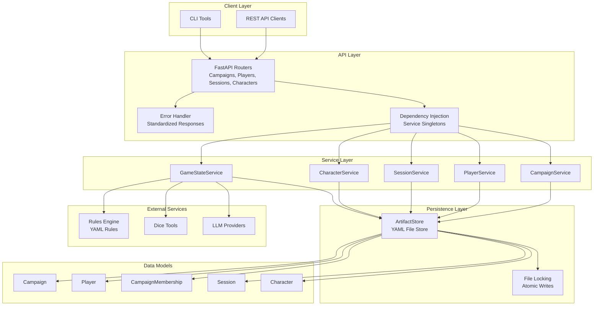
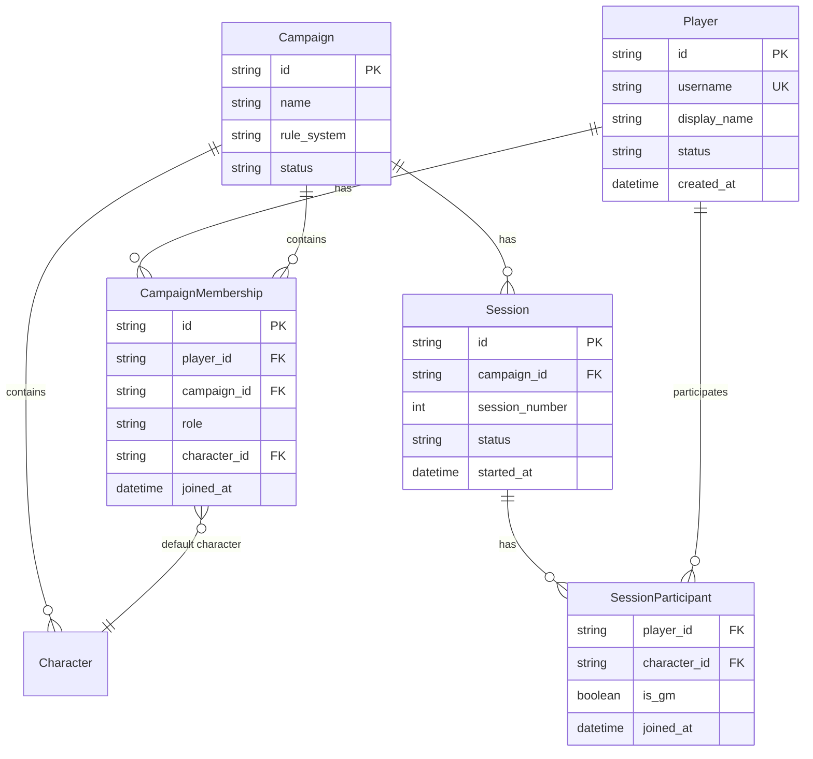
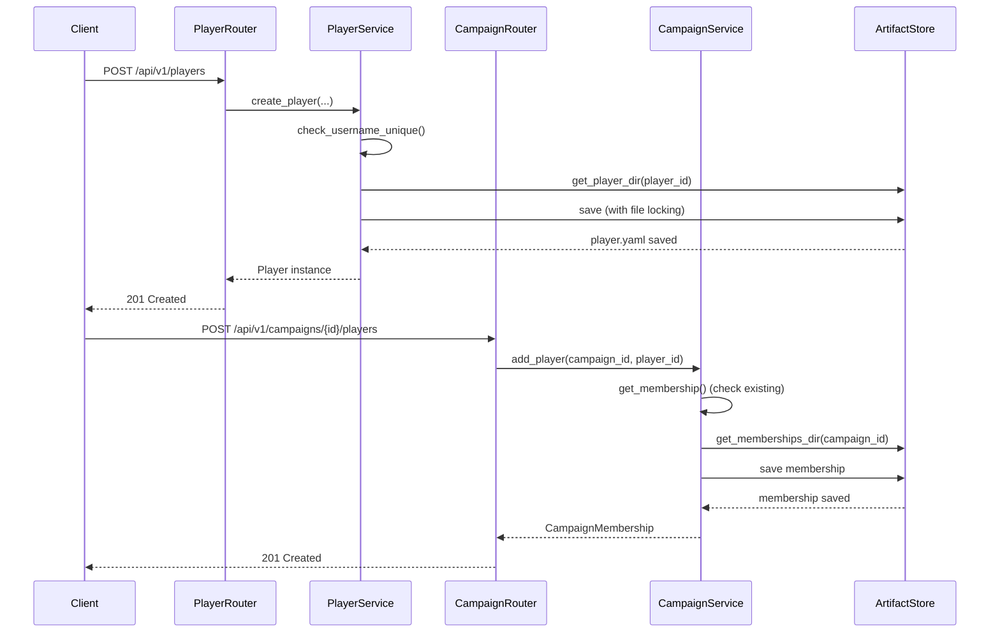
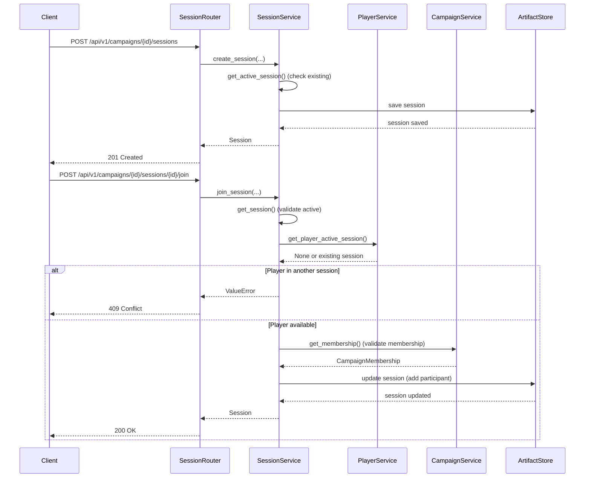
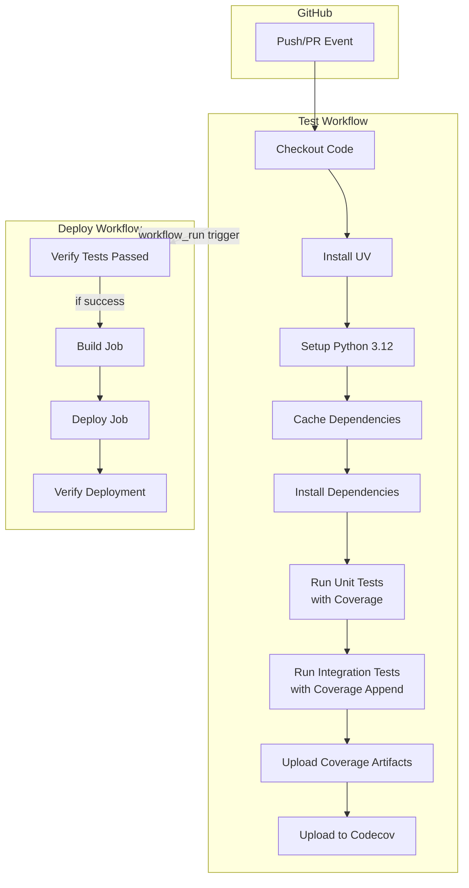
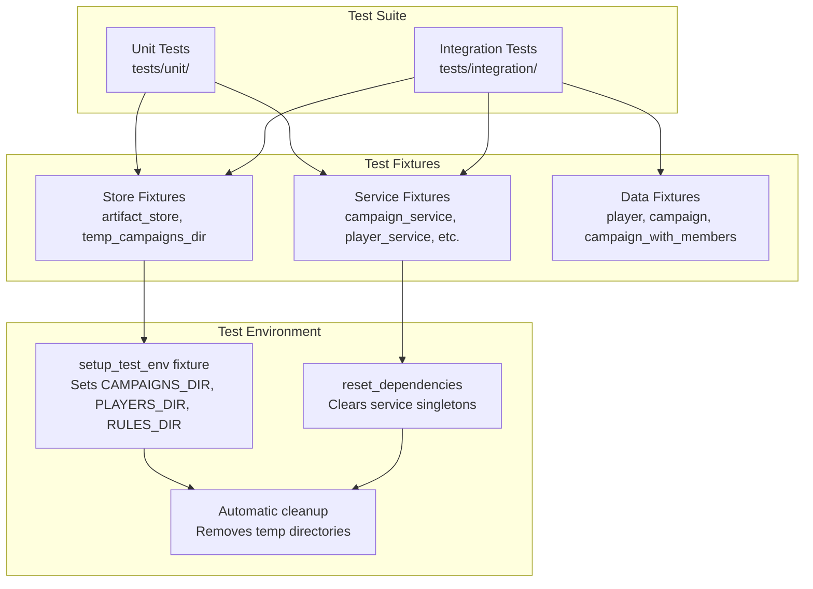

# ADR 0003: Current Architecture State (Post-Player Management & CI/CD Integration)

## Status

Accepted

## Context

This ADR documents the current architecture state of the GM Chatbot system (v2.0+) after the implementation of player management features and CI/CD infrastructure improvements. The system has evolved from the initial REST API-first architecture (documented in [ADR 0002](0002-rest-api-yaml-artifacts-architecture.md)) to include:

1. **Player Management System**: Full CRUD operations for players, with integration into campaign membership
2. **Session Management**: Game session tracking with participant management
3. **Comprehensive Testing Infrastructure**: Unit and integration test separation with shared fixtures
4. **CI/CD Pipeline**: Automated testing and deployment with coverage reporting
5. **Error Handling Standardization**: Consistent API error responses across all endpoints
6. **Data Model Improvements**: Enhanced datetime handling and validation

### Recent Changes (Last 12 Hours)

The following architectural decisions were made in recent commits:

- **Player Management Feature** (`0f23d68`, `4b6ac4f`): Introduced player service, campaign membership model, and player-campaign relationship management
- **Testing Infrastructure** (`3a880f0`, `d784b10`, `9ce2819`, `5dab3a6`): Added GitHub Actions test workflow, Codecov integration, shared store directory pattern, and test environment isolation
- **CI/CD Improvements** (`2e18b53`, `8a90b8c`): Enforced sequential test-deploy workflow with success checks
- **Data Model Fixes** (`9c7adb4`, `47c8c6d`): Improved datetime deserialization, UTC timezone handling, and validation
- **Artifact Store Enhancements** (`97cabe3`): Implemented players_dir derivation logic for test isolation

## Decision

The current architecture maintains the REST API-first approach while adding:

1. **Player Management Layer**: Independent player entities with campaign membership relationships
2. **Service Layer Pattern**: Clear separation between API routers, services, and artifact persistence
3. **Dependency Injection**: Singleton pattern for service instances with reset capability for testing
4. **Test-First CI/CD**: Sequential workflow ensuring tests pass before deployment
5. **Standardized Error Handling**: Consistent error response format across all API endpoints
6. **Enhanced Data Validation**: Pydantic v2 strict mode with improved datetime parsing

## Architecture Overview

### High-Level Architecture



### Service Layer Architecture

```mermaid
graph LR
    subgraph API["API Routers"]
        CampaignRouter[Campaigns Router]
        PlayerRouter[Players Router]
        SessionRouter[Sessions Router]
        CharacterRouter[Characters Router]
    end

    subgraph Services["Services"]
        CampaignService[CampaignService<br/>- CRUD operations<br/>- Membership management]
        PlayerService[PlayerService<br/>- Player CRUD<br/>- Username uniqueness<br/>- Active session tracking]
        SessionService[SessionService<br/>- Session lifecycle<br/>- Participant management<br/>- Active session checks]
        CharacterService[CharacterService<br/>- Character CRUD<br/>- Campaign-scoped]
    end

    subgraph Store["Artifact Store"]
        CampaignStore[Campaign Artifacts<br/>campaigns/{id}/]
        PlayerStore[Player Artifacts<br/>players/{id}/]
        MembershipStore[Membership Artifacts<br/>campaigns/{id}/memberships/]
        SessionStore[Session Artifacts<br/>campaigns/{id}/sessions/]
    end

    CampaignRouter --> CampaignService
    PlayerRouter --> PlayerService
    SessionRouter --> SessionService
    CharacterRouter --> CharacterService

    CampaignService --> CampaignStore
    CampaignService --> MembershipStore
    PlayerService --> PlayerStore
    SessionService --> SessionStore
    SessionService --> MembershipStore
    CharacterService --> CampaignStore
```

### Player-Campaign Relationship



## Key Architectural Decisions

### 1. Player Management as Independent Entity

**Decision**: Players are stored independently from campaigns, with membership managed through `CampaignMembership` artifacts.

**Rationale**:

- Players can exist without being in any campaign
- Players can participate in multiple campaigns
- Clear separation of concerns: player identity vs. campaign participation
- Enables future features like player profiles, preferences, and cross-campaign analytics

**Implementation**:

- Players stored in `players/{player_id}/player.yaml`
- Memberships stored in `campaigns/{campaign_id}/memberships/{player_id}.yaml`
- `PlayerService` handles player CRUD operations
- `CampaignService` handles membership operations

**Consequences**:

- **Positive**: Flexible player management, supports multi-campaign participation
- **Negative**: Requires cross-service queries (e.g., finding player's campaigns)
- **Neutral**: Additional complexity in relationship management

### 2. Service Layer with Dependency Injection

**Decision**: Use singleton pattern for services with dependency injection via FastAPI's `Depends()`.

**Rationale**:

- Single source of truth for service instances
- Easy to mock for testing via `reset_dependencies()`
- Consistent service initialization across the application
- Reduces memory footprint

**Implementation**:

- Global service instances in [`src/gm_chatbot/api/dependencies.py`](src/gm_chatbot/api/dependencies.py)
- `reset_dependencies()` function for test isolation
- Services initialized lazily on first access

**Consequences**:

- **Positive**: Simple dependency management, easy testing
- **Negative**: Global state requires careful reset in tests
- **Neutral**: Works well for current scale, may need refactoring for multi-tenant scenarios

### 3. Standardized Error Handling

**Decision**: All API errors return consistent `{"error": {"code": ..., "message": ..., "details": ...}}` format.

**Rationale**:

- Predictable error responses for API consumers
- Easy error code lookup and handling
- Consistent error structure across all endpoints
- Better developer experience

**Implementation**:

- `APIError` exception class in [`src/gm_chatbot/api/exceptions.py`](src/gm_chatbot/api/exceptions.py)
- Global exception handler in [`src/gm_chatbot/api/app.py`](src/gm_chatbot/api/app.py)
- Standardized error codes in `ErrorCodes` class

**Consequences**:

- **Positive**: Consistent API contract, easier client development
- **Negative**: Requires careful error code management
- **Neutral**: Slight overhead in error wrapping

### 4. Test-First CI/CD Pipeline

**Decision**: Deployment workflow depends on test workflow completion with success verification.

**Rationale**:

- Prevents deployment of broken code
- Ensures test coverage is maintained
- Provides fast feedback on code changes
- Integrates coverage reporting with Codecov

**Implementation**:

- Test workflow (`.github/workflows/test.yml`) runs on all pushes and PRs
- Deploy workflow (`.github/workflows/deploy-fly.yml`) uses `workflow_run` trigger
- Success check in `check-and-deploy` job before build
- Coverage reports uploaded to Codecov

**Consequences**:

- **Positive**: High confidence in deployments, automated quality gates
- **Negative**: Deployment blocked if tests fail (by design)
- **Neutral**: Slightly longer deployment time due to sequential workflow

### 5. Shared Store Directory for Tests

**Decision**: Integration tests use shared temporary directories via environment variables set in `conftest.py`.

**Rationale**:

- Test isolation: each test gets fresh directories
- Consistent test environment setup
- Easy cleanup after tests
- Supports both unit and integration tests

**Implementation**:

- `setup_test_env` fixture in [`tests/conftest.py`](tests/conftest.py) sets `CAMPAIGNS_DIR`, `PLAYERS_DIR`, `RULES_DIR`
- `artifact_store` fixture respects environment variables
- Automatic cleanup after each test

**Consequences**:

- **Positive**: Reliable test isolation, easy to understand
- **Negative**: Requires careful environment variable management
- **Neutral**: Slight overhead in test setup/teardown

### 6. Players Directory Derivation

**Decision**: `players_dir` is derived from `campaigns_dir` when explicitly provided, otherwise uses environment variable or default.

**Rationale**:

- Test isolation: unique players directory per test run
- Production flexibility: can use separate directories
- Backward compatibility: works with existing configurations

**Implementation**:

- Logic in [`src/gm_chatbot/artifacts/store.py`](src/gm_chatbot/artifacts/store.py)
- If `campaigns_dir` explicitly provided, derive `players_dir` as `campaigns_dir.parent / f"players_{campaigns_dir.name}"`
- Otherwise use `PLAYERS_DIR` env var or `/data/players` default

**Consequences**:

- **Positive**: Better test isolation, flexible configuration
- **Negative**: Slightly complex derivation logic
- **Neutral**: Transparent to most users

### 7. Enhanced Datetime Handling

**Decision**: Improved datetime deserialization in `BaseArtifact` with UTC timezone support and ISO format parsing.

**Rationale**:

- Pydantic v2 strict mode requires proper datetime objects
- YAML serialization converts datetimes to strings
- Need to parse ISO format strings back to datetime objects
- Ensure all timestamps are in UTC

**Implementation**:

- `_parse_datetime_strings()` static method in [`src/gm_chatbot/models/base.py`](src/gm_chatbot/models/base.py)
- Recursively parses datetime strings in dict/list structures
- Handles both `Z` suffix and `+00:00` timezone formats
- All model `model_post_init` methods set UTC timestamps

**Consequences**:

- **Positive**: Reliable datetime handling, timezone consistency
- **Negative**: Additional parsing overhead
- **Neutral**: Transparent to API consumers

## Data Flow

### Player Creation and Campaign Membership



### Session Management with Active Session Checks



## CI/CD Pipeline Architecture



## Testing Architecture

### Test Organization



### Test Isolation Strategy

1. **Environment Variables**: Each test gets fresh directories via `setup_test_env` fixture
2. **Dependency Reset**: `reset_dependencies()` clears service singletons before each test
3. **Temporary Directories**: Tests use `tempfile.mkdtemp()` for isolation
4. **Automatic Cleanup**: Directories removed after test completion

## File Structure

### Key Files

**API Layer**:

- [`src/gm_chatbot/api/app.py`](src/gm_chatbot/api/app.py): FastAPI application with error handlers
- [`src/gm_chatbot/api/dependencies.py`](src/gm_chatbot/api/dependencies.py): Service dependency injection
- [`src/gm_chatbot/api/exceptions.py`](src/gm_chatbot/api/exceptions.py): Error handling
- [`src/gm_chatbot/api/routers/players.py`](src/gm_chatbot/api/routers/players.py): Player endpoints
- [`src/gm_chatbot/api/routers/campaigns.py`](src/gm_chatbot/api/routers/campaigns.py): Campaign and membership endpoints
- [`src/gm_chatbot/api/routers/sessions.py`](src/gm_chatbot/api/routers/sessions.py): Session endpoints

**Service Layer**:

- [`src/gm_chatbot/services/player_service.py`](src/gm_chatbot/services/player_service.py): Player management
- [`src/gm_chatbot/services/campaign_service.py`](src/gm_chatbot/services/campaign_service.py): Campaign and membership management
- [`src/gm_chatbot/services/session_service.py`](src/gm_chatbot/services/session_service.py): Session management

**Data Models**:

- [`src/gm_chatbot/models/player.py`](src/gm_chatbot/models/player.py): Player model
- [`src/gm_chatbot/models/membership.py`](src/gm_chatbot/models/membership.py): CampaignMembership model
- [`src/gm_chatbot/models/session.py`](src/gm_chatbot/models/session.py): Session and SessionParticipant models
- [`src/gm_chatbot/models/base.py`](src/gm_chatbot/models/base.py): BaseArtifact with datetime parsing

**Persistence**:

- [`src/gm_chatbot/artifacts/store.py`](src/gm_chatbot/artifacts/store.py): ArtifactStore with file locking

**Testing**:

- [`tests/conftest.py`](tests/conftest.py): Test configuration and environment setup
- [`tests/fixtures/store.py`](tests/fixtures/store.py): Store fixtures
- [`tests/fixtures/services.py`](tests/fixtures/services.py): Service fixtures
- [`tests/fixtures/data.py`](tests/fixtures/data.py): Data fixtures

**CI/CD**:

- [`.github/workflows/test.yml`](.github/workflows/test.yml): Test workflow
- [`.github/workflows/deploy-fly.yml`](.github/workflows/deploy-fly.yml): Deploy workflow

## Consequences

### Positive

1. **Player Management**: Flexible player system supporting multi-campaign participation
2. **Service Layer**: Clear separation of concerns, easy to test and maintain
3. **Error Handling**: Consistent API error responses improve developer experience
4. **CI/CD**: Automated quality gates prevent broken deployments
5. **Test Infrastructure**: Reliable test isolation and comprehensive coverage reporting
6. **Data Validation**: Enhanced datetime handling ensures data consistency
7. **Dependency Injection**: Simple service management with easy testing support

### Negative

1. **Complexity**: Additional layers (players, memberships, sessions) increase system complexity
2. **Cross-Service Queries**: Finding player's campaigns requires scanning all campaigns
3. **Global State**: Service singletons require careful reset in tests
4. **File I/O**: YAML-based persistence may be slower than databases for high-volume scenarios
5. **Deployment Blocking**: Tests must pass before deployment (by design, but can delay fixes)

### Neutral

1. **Scalability**: Architecture supports current scale; may need optimization for larger deployments
2. **State Management**: File-based state is sufficient for current use case
3. **Test Performance**: Test isolation adds slight overhead but ensures reliability
4. **Error Code Management**: Requires discipline to maintain consistent error codes

## Future Considerations

Potential architectural improvements for future ADRs:

1. **Database Migration**: Consider database for high-volume scenarios or complex queries
2. **Caching Layer**: Add Redis for frequently accessed data (players, campaigns)
3. **Event System**: Implement event-driven architecture for session state changes
4. **Query Optimization**: Add indexes or caching for player-campaign relationship queries
5. **Multi-Tenancy**: Refactor service singletons for multi-tenant scenarios
6. **Real-time Updates**: WebSocket support for session state changes
7. **Audit Logging**: Comprehensive audit trail for player and session actions

## References

- [ADR 0001: Architecture Overview](0001-architecture-overview.md) - Historical v1.0 architecture
- [ADR 0002: REST API-First Architecture](0002-rest-api-yaml-artifacts-architecture.md) - v2.0 architecture foundation
- [FastAPI Documentation](https://fastapi.tiangolo.com/)
- [Pydantic v2 Documentation](https://docs.pydantic.dev/)
- [GitHub Actions Documentation](https://docs.github.com/en/actions)
